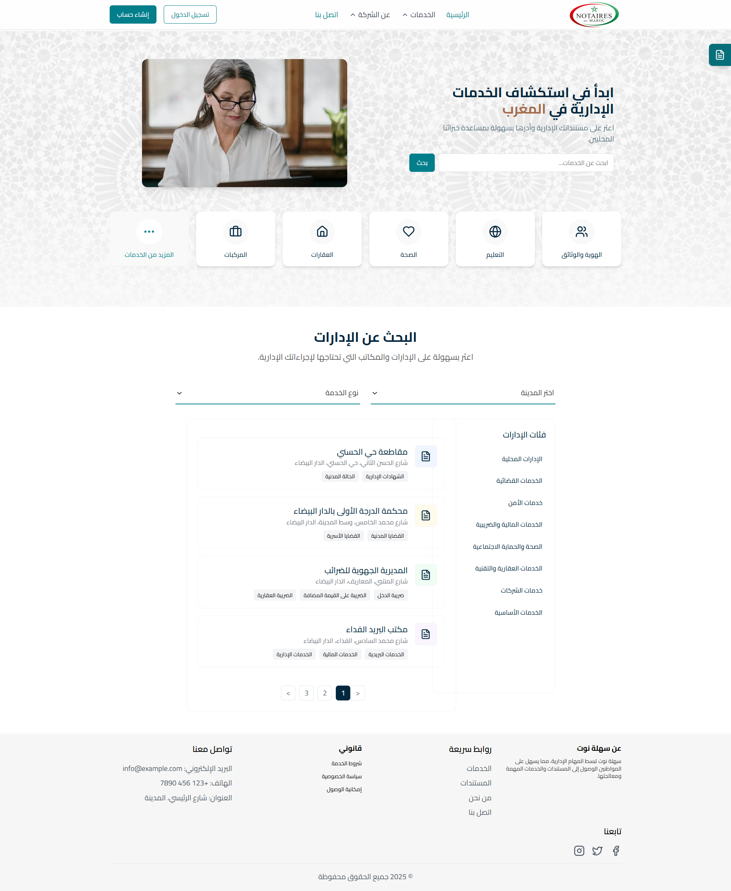
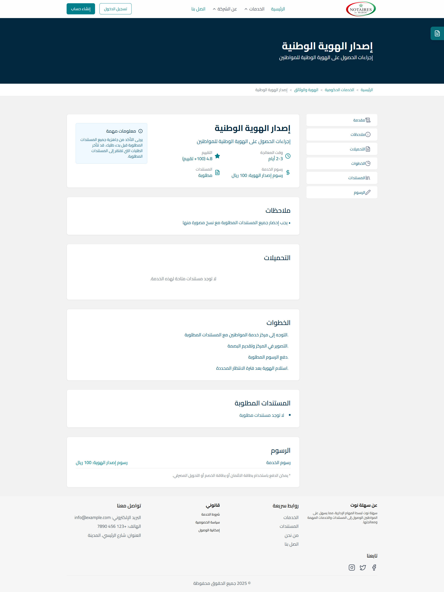
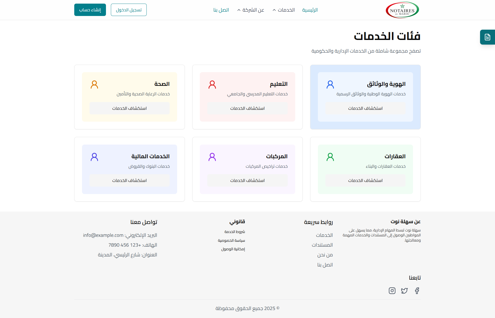
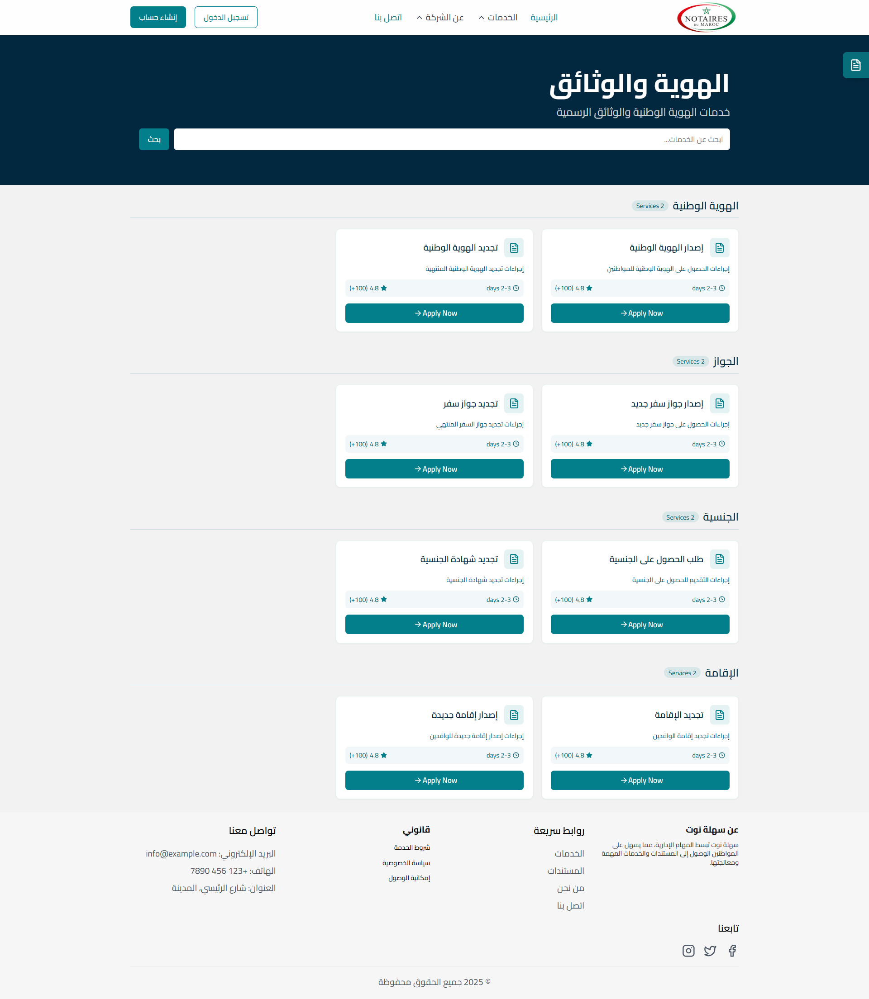
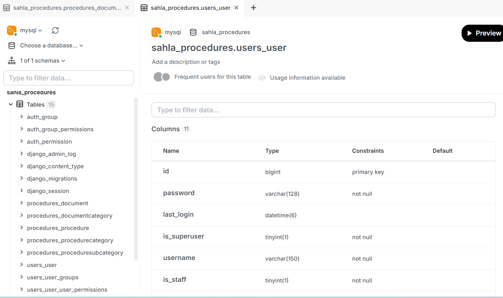

# Sahla Not

A comprehensive Moroccan administrative services platform that centralizes administrative information and documents, providing digital assistance for form filling and streamlined access to public services. The platform aims to simplify administrative procedures for Moroccan citizens through a modern, accessible, and efficient digital solution.


*Home page of Sahla Not*

## 🌟 Project Objectives

### Main Objectives
- Centralize Moroccan administrative information and documents
- Provide digital assistance in form filling
- Enable quick, simple, and secure access to administrative services
- Ensure multi-platform compatibility (web and mobile)
- Improve citizen satisfaction with public procedures

### Key Benefits

1. **Information Centralization**
   - Consolidates all Moroccan administrative procedures in one place
   - Eliminates the need to visit multiple websites or make unnecessary trips

2. **Multi-platform Accessibility**
   - Available on both web and mobile applications
   - Accessible anytime, from any device

3. **Time and Efficiency**
   - Significantly reduces time spent searching for information or documents
   - Direct access to forms and procedures

4. **Intelligent Assistance**
   - Guides users through document completion
   - Prevents common errors (missing documents, incorrect entries)

5. **Enhanced User Experience**
   - Intuitive, modern interface suitable for all user profiles
   - Fast and fluid navigation

6. **Data Reliability**
   - Regularly verified and updated information
   - Clear guidance on required documents and procedures

7. **Administrative Load Reduction**
   - Decreases physical office traffic
   - Reduces administrative staff workload

8. **Territorial Inclusivity**
   - Benefits citizens in rural or remote areas
   - Improves access to administrative services

9. **Project Scalability**
   - Expandable to additional services (health, education, justice...)
   - Adaptable to other countries with similar contexts


*Administrative procedures interface*


*Service categories view*


*Detailed service category view*


*Administrative dashboard*


*Database structure*

## 🚀 Tech Stack

### Backend
- **Framework**: Django 5.0.2
- **API**: Django REST Framework 3.14.0
- **Authentication**: JWT (djangorestframework-simplejwt)
- **Database**: 
  - MySQL (mysqlclient)
- **Image Processing**: Pillow
- **Environment Variables**: python-dotenv
- **CORS**: django-cors-headers

### Frontend
- **Framework**: Next.js 14
- **Language**: TypeScript
- **Styling**: 
  - Tailwind CSS
  - Radix UI Components
- **State Management**: React Hooks
- **Form Handling**: React Hook Form with Zod validation
- **Internationalization**: i18next
- **UI Components**: 
  - Radix UI (comprehensive component library)
  - Lucide React (icons)
  - Sonner (toasts)
  - Recharts (charts)
- **Development**: TypeScript, PostCSS


## 🛠️ Project Structure

```
sahla-not/
├── backend/                 # Django backend
│   ├── media/              # Media files
│   ├── users/              # User management
│   ├── procedures/         # Business logic
│   ├── procedures_backend/ # Backend procedures
│   └── manage.py           # Django management script
│
└── frontend/               # Next.js frontend
    ├── app/               # Next.js app directory
    ├── components/        # Reusable components
    ├── contexts/         # React contexts
    ├── hooks/            # Custom hooks
    ├── lib/              # Utility functions
    ├── public/           # Static assets
    ├── styles/           # Global styles
    └── translations/     # i18n translations
```

## 🛠️ Setup and Installation

### Backend Setup

1. Create and activate a virtual environment:
```bash
cd backend
python -m venv venv
source venv/bin/activate  # On Windows: venv\Scripts\activate
```

2. Install dependencies:
```bash
pip install -r requirements.txt
```

3. Set up environment variables:
Create a `.env` file in the backend directory with necessary configurations.

4. Run migrations:
```bash
python manage.py migrate
```

5. Start the development server:
```bash
python manage.py runserver
```

### Frontend Setup

1. Install dependencies:
```bash
cd frontend
npm install
```

2. Set up environment variables:
Create a `.env.local` file in the frontend directory.

3. Start the development server:
```bash
npm run dev
```

## 🔧 Development

- Backend API runs on `http://localhost:8000`
- Frontend development server runs on `http://localhost:3000`
- API documentation available at `http://localhost:8000/api/docs/`

## 👥 Development Team

### Ikram Kharroubi


- **GitHub**: [@ikramkharroubi](https://github.com/ikramkharroubi)
- **Contributions**:
  - Led the development of the intelligent form-filling assistance system
  - Implemented the administrative procedures database architecture
  - Developed the multi-language support system (i18n)
  - Created the user authentication and authorization system
  - Designed and implemented the responsive UI components using Radix UI

### Ilyas Belaoud


- **GitHub**: [@ilyasbelaoud](https://github.com/ilyasbelaoud)
- **Contributions**:
  - Built the RESTful API endpoints using Django REST Framework
  - Implemented the document processing and validation system
  - Developed the search and filtering functionality
  - Created the admin dashboard interface
  - Integrated the database with MySQL and optimized queries


